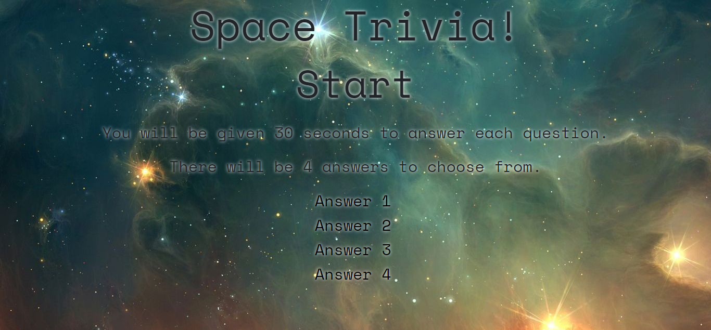

# Space Trivia!

Space themed trivia.

## Getting Started

You can find the game at this link: 
[Space Trivia](https://liangbryan2.github.io/TriviaGame/)

### Prerequisites

This game was tested on Google Chrome but should work on any internet browser.

```
Google Chrome
Firefox
Microsoft Edge
etc.
```
### Images



### Code Snippets
JavaScript
``` js
$(document).on("click", ".choice", function () {
        if (playing) {
            var choice = $(this).text();
            if (choice === answer) {
                correctAnswer();
            } else {
                wrongAnswer();
            }
        }
    });
});
```
CSS
``` css
button {
    font-size: 30px;
    text-shadow: white 0px 0px 10px;
    background-color: Transparent;
    background-repeat: no-repeat;
    border: none;
    cursor: pointer;
    overflow: hidden;
    outline: none;
}
```
HTML
``` html
<div id="answers">
    <button type="button">Answer 1</button> <br>
    <button type="button">Answer 2</button> <br>
    <button type="button">Answer 3</button> <br>
    <button type="button">Answer 4</button> <br>
</div>
```

## Built With

* HTML
* JavaScript/jQuery
* CSS/Bootstrap

## Learning Points

The main goal of this project was to learn how to use the setTimeout and setInterval functions of JavaScript. Of course, there was still a lot of DOM manipulation and logic to be defined. But, that was the focus of the [Crystal Collector](https://liangbryan2.github.io/Crystal-Game/) game. Another big part of this project was how to access different items in objects. I stored my questions and answers in an array of objects, so I had to familiarize myself with accessing nested items. I also added in a couple of CSS animations. The more I look into what can be done, the more amazed I become.

## Author

**Bryan Liang** - [My Github](https://github.com/liangbryan2)

## License

This project is licensed under the MIT License - see the [LICENSE.md](LICENSE.md) file for details

## Acknowledgements
I took a lot of the questions and answers from this page:

[Astrophysics Quiz](http://quizzes.howstuffworks.com/quiz/astrophysics-quiz)